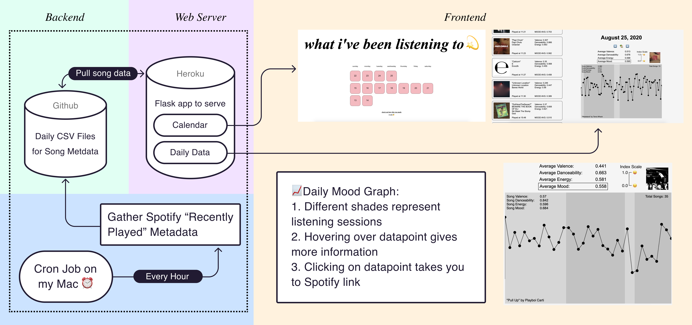

# SPOTIFY MOOD COLLECTOR

I wanted to find a way to document myself with no extra daily effort. Spotify's API has mood indexes for songs, so I made a website to practice data collection/visualization and full stack web development.

[check out project site](http://trudy.tube)

you can also see all the csvs in the daily data folder

